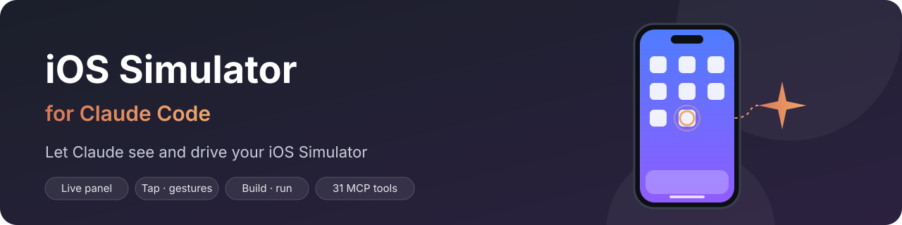
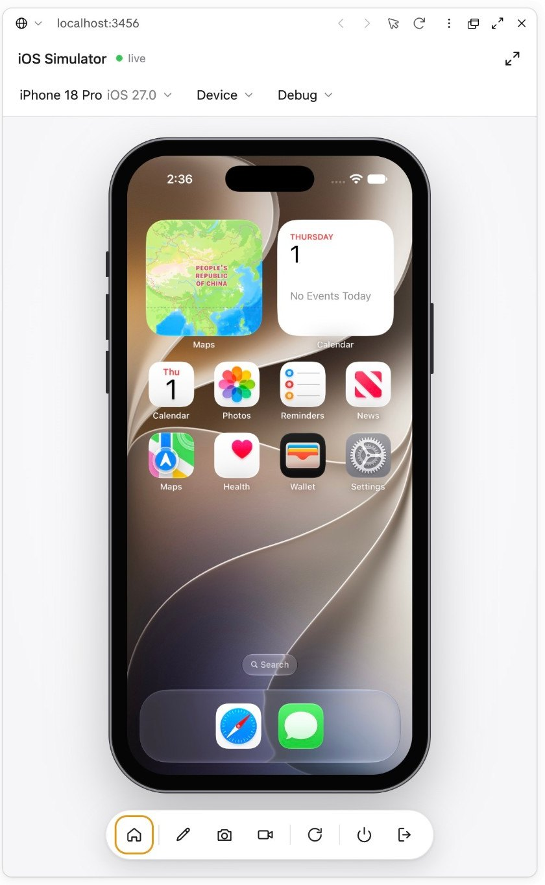
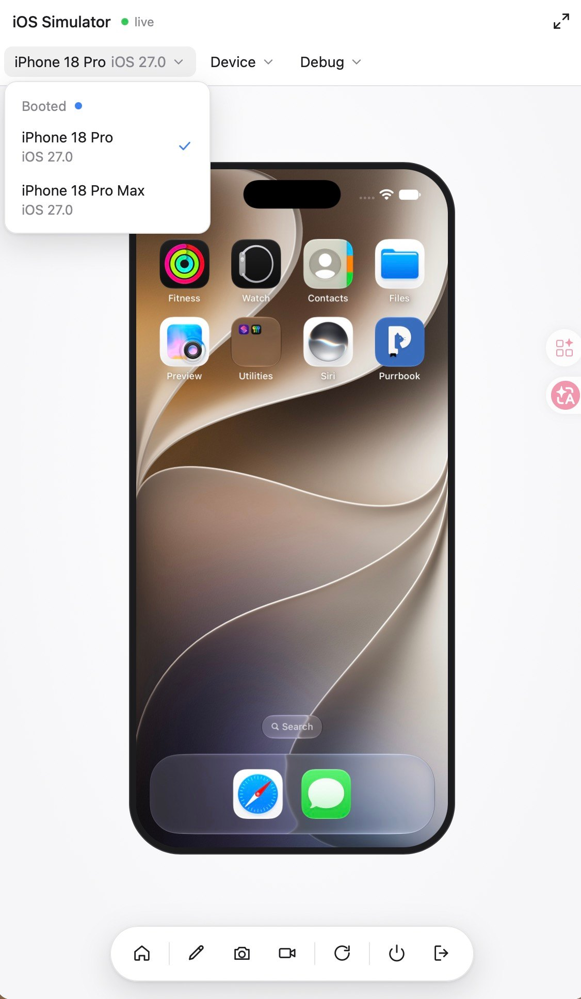
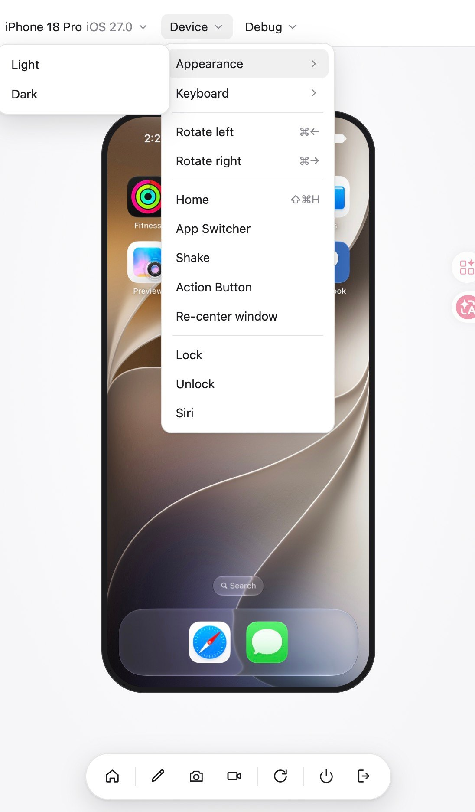
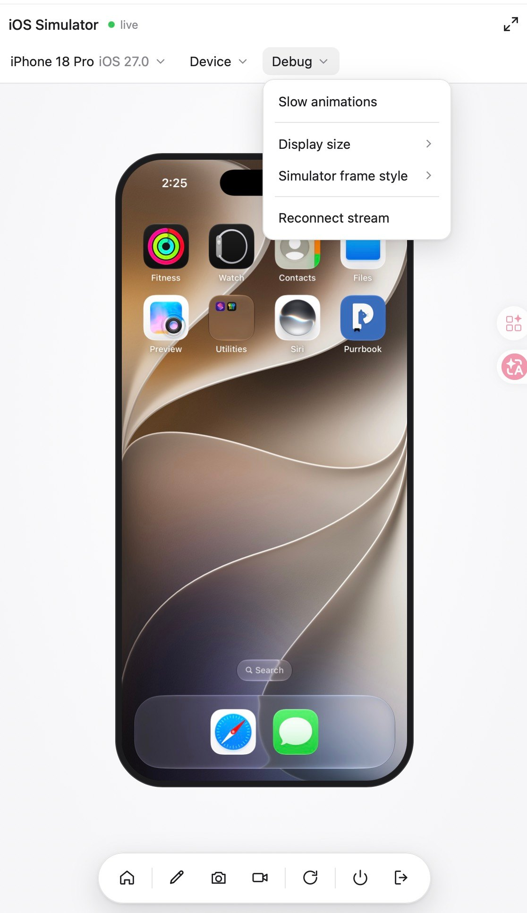
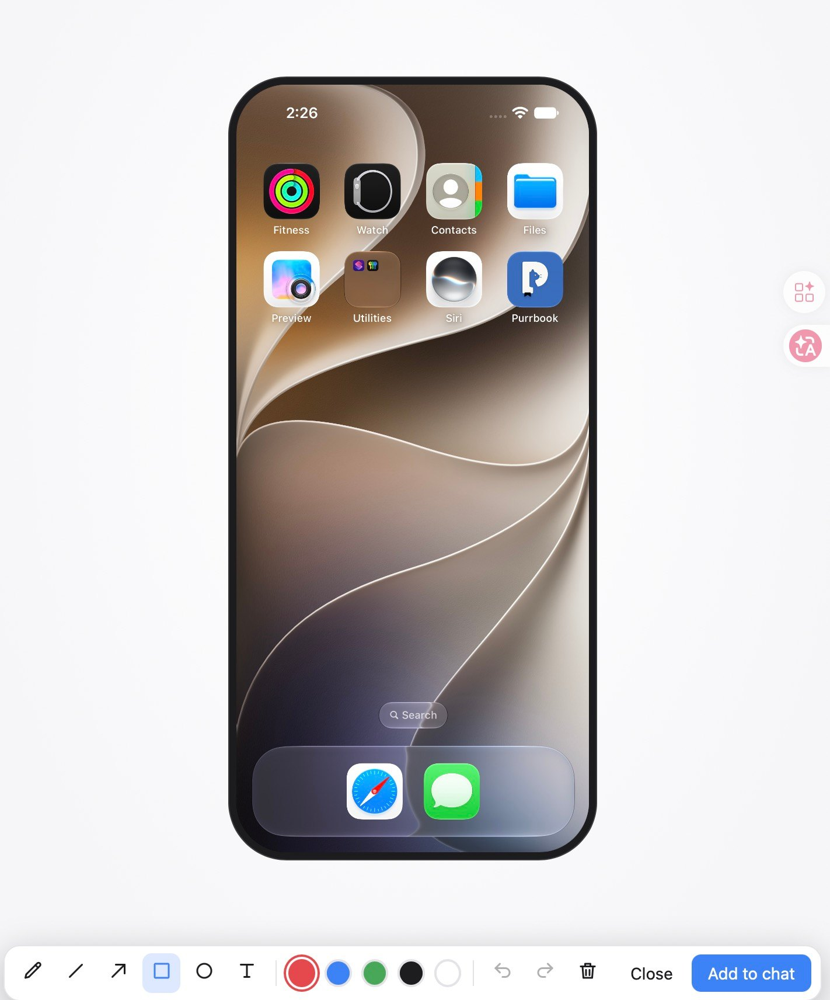
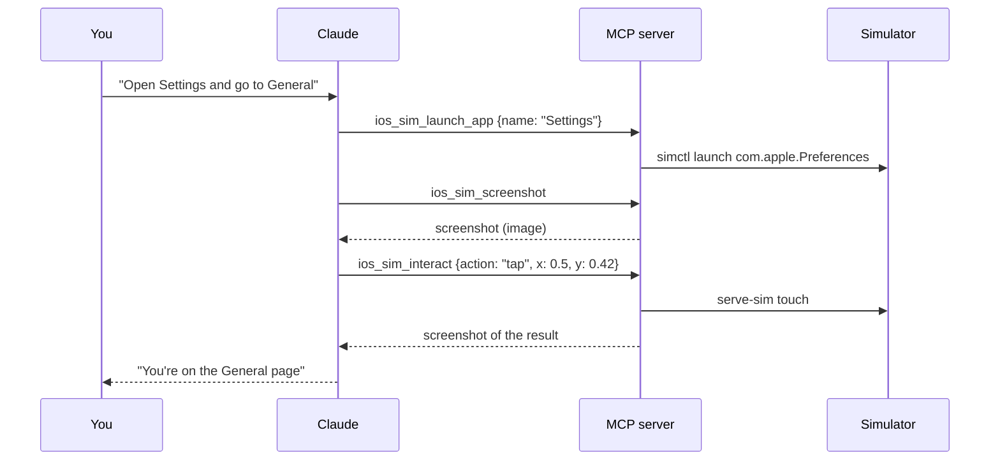
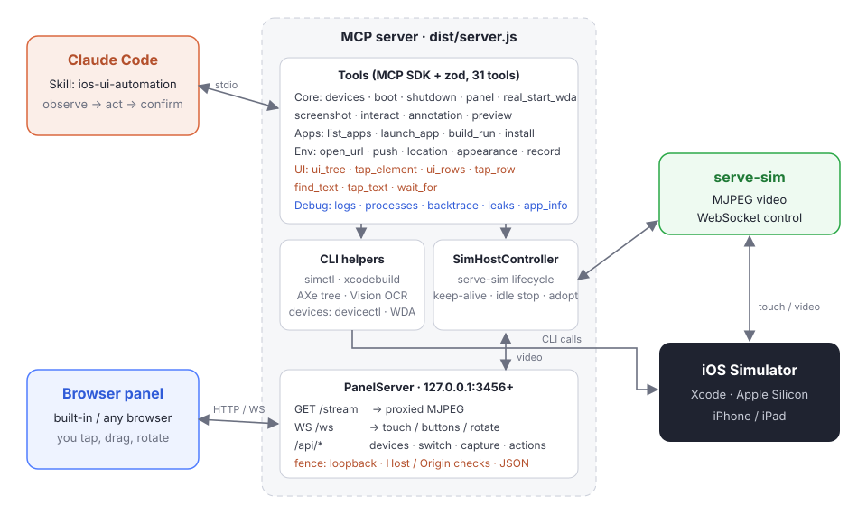

<p align="center">
  
</p>

<p align="center">
  
  
  
  
  
</p>

<p align="center"><a href="README.md">中文</a> | <b>English</b></p>

# iOS Simulator plugin for Claude Code

Drive the iOS Simulator right from Claude Code: a **live panel**, taps and gestures, **finding and tapping by accessibility tree or on-screen text (OCR)**, installing and launching apps, **building and running** from source, push notifications, location, dark mode, screen recording, **logs, backtraces and memory-leak checks**, **SwiftUI previews with hot reload**… Claude sees the screenshots and reads the controls and text on screen, and you can operate the same simulator yourself in the same panel.

> [!NOTE]
> This project builds on **[dsh-ios](https://github.com/ZSeven-W/dsh-ios)**, the iOS plugin for DeepSeek Harness (DSH) (MIT, © 2026 ZSeven—W).
> We ported its host-independent core, removed the DSH-specific bindings, rewrapped it with the MCP SDK as a **Claude Code plugin**, and reworked it around the fact that Claude can see images. See [Differences from dsh-ios](#differences-from-dsh-ios).

---

## Contents

- [Preview](#preview)
- [Features](#features)
- [Tools (31)](#tools-31)
- [Requirements](#requirements)
- [Installation](#installation)
- [Quick start](#quick-start)
- [Live panel](#live-panel)
- [Architecture](#architecture)
- [Differences from dsh-ios](#differences-from-dsh-ios)
- [Environment variables](#environment-variables)
- [FAQ](#faq)
- [Development](#development)
- [Roadmap](#roadmap)
- [Credits and license](#credits-and-license)

---

## Preview

<p align="center">
  
</p>

<p align="center"><sub>The live panel in Claude Code desktop's built-in browser (its layout follows the desktop app's own iOS Simulator): the device picker and the Device and Debug menus at the top, tap / drag right on the screen, and the dock at the bottom — Home, annotate, save screenshot, record, rotate, shut down, detach.</sub></p>

<table>
  <tr>
    <td align="center" width="25%"><br><sub><b>Device picker</b><br>Booted / real devices / shut down</sub></td>
    <td align="center" width="25%"><br><sub><b>Device menu</b><br>Appearance, keyboard, rotation, device actions</sub></td>
    <td align="center" width="25%"><br><sub><b>Debug menu</b><br>Slow animations, display size, frame</sub></td>
    <td align="center" width="25%"><br><sub><b>Annotation</b><br>Mark it up, then "Add to chat"</sub></td>
  </tr>
</table>

---

## Features

| Area | What you get |
|---|---|
| 🎥 **Live view** | serve-sim's MJPEG video stream (not polled screenshots), reconnecting after 1 s → 2 s → 5 s; the panel opens by itself the first time it starts — in the default browser from the terminal, in the built-in browser in Claude Code desktop |
| 🪟 **Panel** | Laid out like Claude Code desktop's iOS Simulator: device picker, Device / Debug menus, a device frame, and a floating dock (Home, annotate, save screenshot, record, rotate, shut down, detach) with shortcut tooltips; icons from Boxicons |
| 👆 **Interaction** | Taps, drag / swipe gestures, scrolling named by content direction, typing, hardware buttons (Home, lock, Siri, volume…), rotation in four directions |
| 🧩 **UI automation** | Read the accessibility tree and tap controls by identifier / label; Vision OCR reads on-screen text (Chinese and English) and taps by text; wait for text to appear or disappear; confirm the result of a tap in the same call |
| ⚡ **SwiftUI previews with hot reload** | Run a Swift package's `#Preview` / `PreviewProvider` in the simulator; saved edits are hot-swapped in seconds without restarting the app; on a compile error the last working preview stays up |
| 🐞 **Logs and debugging** | Read the simulator's unified log (the last few minutes or a timed live capture, filtered by app / predicate / regex); list running app processes; backtraces (LLDB batch mode, falling back to `sample`); `leaks` summaries or `.memgraph` exports; an app's bundle path, data container and Info.plist |
| 📰 **Lists and feeds** | Split a feed into rows and parse each row's counters ("57 replies", "18 likes"); tap at a relative position inside a row and confirm the counter moved by ±1 |
| 📱 **Device actions** | App Switcher, lock, unlock, shake, Siri, Action button, re-center the window, on-screen keyboard, slow animations |
| ✏️ **Screenshot annotation** | The pencil in the panel freezes the screen; mark it up with pen / line / arrow / box / ellipse / text (5 colors, undo / redo) and press "Add to chat": the image is stored for Claude (`ios_sim_annotation`) and copied to the clipboard |
| 👀 **Claude sees the screen** | Screenshots come back to Claude as **images** (JPEG, long edge ≤ 1024 px); every interaction returns a screenshot of its effect |
| 🧭 **Orientation** | Screenshots are always upright; Claude's coordinates are mapped onto the device for the current orientation |
| 📦 **Apps** | List installed apps (names localized to the simulator's language and searchable), launch / relaunch by name or bundle id, install a `.app`, uninstall |
| 🔨 **Build and run** | `.xcodeproj`, `.xcworkspace` and Swift packages: build → install → launch, returning the filtered compiler errors on failure |
| 🌐 **Environment** | Open URLs / deep links, simulated push notifications (APNs payload), set / clear the GPS location, light / dark appearance |
| 🎬 **Recording** | Start / stop screen recording to `.mov` / `.mp4`, one recording per device at a time |
| 🖥️ **Several devices** | List, boot and shut down any simulator; switch in the panel with one click (a shut-down device is booted) |
| 📲 **USB iPhones and iPads** | List connected devices; list / launch / terminate apps, install a signed `.app`, and read processes and app info on the device (devicectl). With WebDriverAgent started by `ios_real_start_wda`, screenshots, taps, typing, buttons, swipes, rotation, the accessibility tree, OCR find / tap and list rows work on the device too, and the panel shows its live screen and takes touches |
| 🧠 **Built-in skill** | `ios-ui-automation` teaches Claude an observe → act → confirm rhythm and steers it around common traps (such as guessing bundle ids) |
| 🔒 **Security** | The panel listens on `127.0.0.1` only and checks Host / Origin against DNS rebinding and cross-site calls; every command runs with an argument array, so no shell injection |
| 🌏 **Chinese and English** | The panel follows the browser language (Chinese / English) |

---

## Tools (31)

Every tool takes an optional `udid` (a udid or a device name such as `"iPhone 17 Pro"`). These tools also take the udid or name of a **connected iPhone or iPad** (listed under `realDevices` by `ios_sim_devices`):

- right away (devicectl): `ios_sim_list_apps`, `ios_sim_launch_app`, `ios_sim_install_app`, `ios_sim_processes`, `ios_sim_app_info`;
- once `ios_real_start_wda` has started WebDriverAgent: `ios_sim_screenshot`, `ios_sim_interact`, `ios_sim_ui_tree`, `ios_sim_tap_element`, `ios_sim_find_text`, `ios_sim_tap_text`, `ios_sim_wait_for`, `ios_sim_ui_rows`, `ios_sim_tap_row`.

Without a `udid` the tools use the streamed device, else the first booted one. `ios_sim_interact` coordinates are **normalized 0..1**; the UI-automation tools report positions in device **points**.

### Devices and screen

| Tool | What it does |
|---|---|
| `ios_sim_devices` | Lists simulators (booted and newest runtimes first), filterable by name / udid / runtime; connected iPhones and iPads are under `realDevices` |
| `ios_sim_boot` | Boots a simulator, starts the stream and returns `panelUrl` |
| `ios_sim_shutdown` | Shuts a simulator down (stopping its recording and stream first) |
| `ios_sim_panel` | Makes sure a booted device streams and returns `panelUrl`, never booting anything; given an iPhone running WebDriverAgent, the panel shows that phone instead |
| `ios_sim_screenshot` | Takes a screenshot, returned to Claude as an image, plus the full-size PNG path |
| `ios_sim_interact` | `tap` / `type` / `button` / `gesture` / `scroll` / `rotate` / `device_action`, returning a screenshot of the effect by default |
| `ios_sim_annotation` | Returns the screenshots you annotated in the panel (newest first; `index` for older ones, `list: true` for the list only); screenshot results carry `userAnnotations` when there are new ones |
| `ios_real_start_wda` | Starts WebDriverAgent on a USB-connected iPhone / iPad (adopting one that already runs, else signing, building and launching it; a cold build takes minutes); `status` reports, `stop` stops it |

### Apps

| Tool | What it does |
|---|---|
| `ios_sim_list_apps` | Lists installed apps (bundle id, localized name, version), searchable, optionally with system apps |
| `ios_sim_launch_app` | Launches by `bundleId` or `name` (a display-name substring, Chinese works), with `relaunch` |
| `ios_sim_build_run` | Builds an Xcode project / workspace / Swift package, then installs and launches it |
| `ios_sim_install_app` | Installs a built `.app` and returns its bundle id |
| `ios_sim_uninstall_app` | Uninstalls by bundle id (with its data) |

### Environment

| Tool | What it does |
|---|---|
| `ios_sim_open_url` | Opens `https://…` or a deep link such as `myapp://path` |
| `ios_sim_push` | Sends a simulated push; the payload needs an `aps` object |
| `ios_sim_location` | Sets latitude / longitude, or `clear: true` |
| `ios_sim_appearance` | Switches `light` / `dark` |
| `ios_sim_record` | `start` / `stop` screen recording, returning the file path, size and duration |

### UI automation

| Tool | What it does |
|---|---|
| `ios_sim_ui_tree` | Reads the frontmost app's accessibility tree: type, label, identifier, value, enabled / selected, frames in points; off-screen elements are excluded by default and the output is capped at about 40 KB |
| `ios_sim_tap_element` | Taps a control by identifier and / or label (exact match first, then case-insensitive substring); off-screen or disabled matches are refused with the reason |
| `ios_sim_find_text` | Reads the current screen with Vision OCR: text, confidence and position in points |
| `ios_sim_tap_text` | OCRs the screen and taps the center of the matching text; several matches are listed as candidates |
| `ios_sim_wait_for` | Polls OCR until text appears or disappears; a timeout returns `matched: false`, not an error |
| `ios_sim_ui_rows` | Splits a list / feed into rows: index, frame, merged label, and the counters parsed from the label |
| `ios_sim_tap_row` | Taps at a relative position inside row N; `expect_count` checks that a counter moved by exactly ±1 |

### SwiftUI previews

| Tool | What it does |
|---|---|
| `ios_sim_preview` | `start` (default): generates a throwaway preview host app in the plugin cache, compiles the Swift package into a dynamic library in the simulator and watches the sources; every save recompiles and hot-swaps without restarting the app. `status`: the current generation, the previews, the last reload time and compile errors. `stop`: stops watching and removes the host app. One preview session at a time |

Supports `#Preview { … }` (including `#Preview("Name", traits: …)`) and `struct X: PreviewProvider`, scanning the package's `.target(...)` sources only. Previews may use `internal` types (the entry point imports your module with `@testable import`). The host app and build products live in the plugin cache: **nothing is written into your package**.

### Logs and debugging

| Tool | What it does |
|---|---|
| `ios_sim_logs` | Reads the unified log: `snapshot` (default, `log show --last 2m`) or `follow` (captures live for 1–60 s); filters by `bundle_id`, NSPredicate, level and `grep`; keeps the last ~300 lines / 30 KB |
| `ios_sim_processes` | Lists running app processes from the simulator's own launchd (pid, name, bundle id) |
| `ios_sim_backtrace` | A one-shot backtrace: LLDB batch mode (attach → backtrace → detach), falling back to `sample` when attaching is not allowed; main thread first, about 200 lines at most |
| `ios_sim_leaks` | `leaks` analysis: `summary` returns the leak count, bytes and the 30 biggest types; `memgraph` exports a file for Instruments |
| `ios_sim_app_info` | An installed app's `.app` path, data container (Documents and so on) and Info.plist |

`ios_sim_backtrace` / `ios_sim_leaks` only ever touch **app processes inside this simulator**, never other processes on the Mac; afterwards (including after a timeout kill) they make sure the app is running again rather than stuck in a debugger.

`ios_sim_tap_element` and `ios_sim_tap_text` take `expect_text` / `expect_gone`: after the tap they poll OCR and report in the same call whether the text appeared / disappeared. All three tap tools return a screenshot of the effect.

<details>
<summary><b>ios_sim_interact actions</b></summary>

| action | Key parameters | Notes |
|---|---|---|
| `tap` | `x`, `y` | Normalized: `x = pixel x / screenshot width`, `y = pixel y / screenshot height` |
| `type` | `text` | US-keyboard ASCII only (for Chinese see the [FAQ](#faq)) |
| `button` | `name` | `home`, `lock`, `siri`, `volume-up`…; an unknown name returns the full list |
| `gesture` | `json` | A drag `{"fromX":0.1,"fromY":0.5,"toX":0.9,"toY":0.5,"duration":0.3}` or one frame `{"type":"begin","x":0.5,"y":0.5}` |
| `scroll` | `direction`, `amount?`, `x?`, `y?` | Named by the **content**: `down` shows what is below (the finger moves up); `amount` defaults to 0.6 |
| `rotate` | `orientation` | `portrait` / `landscape_left` / `portrait_upside_down` / `landscape_right` |
| `device_action` | `name` | `app-switcher` / `lock` / `unlock` / `shake` / `siri` / `action-button` / `re-center` / `toggle-keyboard` (on-screen keyboard) / `slow-animations` |

When chaining actions, pass `screenshot: false` on all but the last step to save the screenshot tokens.

</details>

---

## Requirements

- **macOS with full Xcode** (`xcrun simctl`, `xcodebuild`)
- **Apple Silicon** (serve-sim ships arm64 only; on an Intel Mac you can boot devices, take screenshots and manage apps, but there is no live view or touch)
- **Node.js ≥ 20**
- UI automation:
  - The accessibility-tree tools need [AXe](https://github.com/cameroncooke/AXe). It is looked up on PATH and in Homebrew (`brew install cameroncooke/axe/axe`); failing both, the pinned v1.8.0 is downloaded on first use and its SHA-256 verified.
  - The OCR tools need `swiftc` (from Xcode or the Command Line Tools); on first use the bundled `assets/ocr.swift` is compiled into the cache.
- SwiftUI previews: a Swift package (a `Package.swift` with at least one `.target`), iOS 17 or later (the `#Preview` macro needs it). The first start compiles the whole package and can take about a minute.
- Debugging: `ios_sim_backtrace` attaches with LLDB and `ios_sim_leaks` inspects the app process; both need macOS Developer Mode (run `sudo DevToolsSecurity -enable` once). Without it, backtrace falls back to `sample` and leaks fails with that command in the message.
- USB iPhones: connected by cable, unlocked, "Trust This Computer" accepted, Developer Mode on. The screenshot / tap / UI tools also need:
  - an Apple ID signed in under Xcode ▸ Settings ▸ Accounts (a free personal team works), or `IOS_SIM_TEAM_ID`;
  - a [WebDriverAgent](https://github.com/appium/WebDriverAgent) checkout: `git clone https://github.com/appium/WebDriverAgent.git ~/Library/Caches/ios-simulator/WebDriverAgent` (or point `IOS_SIM_WDA_DIR` at an existing one). The plugin never modifies it: it builds a private copy in its cache with safety patches that bind WDA to the phone's loopback only, so WDA is reachable through the USB tunnel and not by other devices on the same Wi-Fi;
  - the tunnel goes straight through usbmuxd, falling back to `iproxy` (`brew install libimobiledevice`).
- All `device_action`s except lock drive Simulator.app's menus and need the app running Claude enabled under **System Settings ▸ Privacy & Security ▸ Accessibility**

---

## Installation

### Option 1: from GitHub (recommended)

In Claude Code:

```text
/plugin marketplace add elisezhu123/cc-ios-simulator
/plugin install ios-simulator@ios-simulator-panel
```

### Option 2: from a local clone

```bash
git clone https://github.com/elisezhu123/cc-ios-simulator.git
```

```text
/plugin marketplace add /path/to/cc-ios-simulator
/plugin install ios-simulator@ios-simulator-panel
```

### Option 3: development (load the folder directly)

```bash
claude --plugin-dir /path/to/cc-ios-simulator
```

> `dist/` is committed, so nothing needs building after installation. serve-sim comes from the plugin first, else `npx -y serve-sim@0.1.47`.

---

## Quick start

After installing, tell Claude what you want in plain words:

```text
Boot the iPhone 17 Pro simulator and open the live panel
```

`ios_sim_boot` starts the panel and returns `panelUrl` (by default `http://127.0.0.1:3456/`). The first time the panel starts it is opened for you:

- **Terminal (Claude Code CLI)**: it opens in the default browser.
- **Claude Code desktop**: the built-in browser is opened by Claude with `preview_start`, which reads the project's `.claude/launch.json`. The tool result therefore carries a ready-made configuration (`openInClaude`); Claude adds it to launch.json and calls `preview_start`, and the panel appears in the built-in browser on the right. That configuration runs a small proxy that listens on the port the built-in browser assigns and forwards to the panel, so it never takes the panel's own port.

To change this, set `IOS_SIM_OPEN_PANEL` (see [Environment variables](#environment-variables)).

More examples:

```text
Build ~/Projects/MyApp/MyApp.xcodeproj and run it in the simulator
Open Settings, go to General ▸ About and tell me the iOS version
On MyApp's login screen type test@example.com, tap Log In and check for errors
Send com.example.myapp a push: "Your order has shipped"
Set the location to Shanghai (31.2304, 121.4737), switch to dark mode, then take a screenshot
Start recording, swipe through the onboarding, then stop recording
Tap "General" in Settings and confirm the page shows "About"
Wait until "Loading" disappears, then read all the text on screen
Like the second post in the feed and confirm the like count went up by one
MyApp hangs after tapping Log In: grab the main thread's backtrace and its logs from the last minute
Check MyApp for memory leaks
Preview the SwiftUI previews of ~/Projects/DesignKit in the simulator and refresh as I edit
```

A typical exchange:



---

## Live panel

The panel is a local web page (`127.0.0.1:3456`, or the next free port up to +20) that opens by itself the first time it starts (see [Quick start](#quick-start)). Its layout follows Claude Code desktop's own iOS Simulator:

- **Right on the screen**: click to tap, press and drag for gestures; letterboxing is accounted for and landscape is mapped for the orientation.
- **Title bar**: connection status (live / connecting / offline) and full screen.
- **Device picker**: grouped into Booted / iPhone·iPad (real devices) / Shut down, with the current device checked; picking a shut-down simulator boots it and switches the view.
- **Device menu**: appearance (light / dark), keyboard (show the on-screen keyboard ⌘K), rotate left / right (⌘← / ⌘→), Home, App Switcher, shake, Action button, re-center the window, lock, unlock, Siri.
- **Debug menu**: slow animations, display size (fit / 50–125% / S·M·L), frame (none / bezel / device, device by default), reconnect the stream. Display settings are kept in the browser.
- **Dock** (hover for the name and shortcut):
  - Home (⇧⌘H): click for the Home Screen, **double-click** for the App Switcher;
  - Annotate (pencil): freeze a full-resolution screenshot and draw on it with pen / line / arrow / box / ellipse / text in red, blue, green, black or white; undo (⌘Z) / redo (⇧⌘Z) / clear, Esc closes; "Add to chat" (⌘↩) stores the annotated image for Claude (ask it to call `ios_sim_annotation`, or it notices on its next screenshot) and copies it to the clipboard, ready to paste into the chat;
  - Save screenshot (⌘S): downloads the full-size PNG;
  - Record video (⌘R): press again to stop; the saved path is shown;
  - Rotate right (⌘→);
  - Shut down simulator: stops the recording and the stream first, then shuts down;
  - Detach simulator: stops the panel's view only; the simulator keeps running (on a real device, back to simulators).
- Slow animations, the on-screen keyboard and every device action except lock click Simulator.app's menus and need the Accessibility permission (see [Requirements](#requirements)).
- Your clicks in the panel and Claude's tool calls drive **the same simulator**, so either of you can take over at any time.
- **Real devices**: once `ios_real_start_wda` has started WebDriverAgent, the phone appears in the picker's "iPhone / iPad" group (or call `ios_sim_panel {udid: the phone}`). The view is WDA's MJPEG stream (through the USB tunnel); a click taps, a drag swipes (sent as one swipe with the drag's duration on release). Home, annotate, save screenshot and rotate work, and the Device menu offers rotation, lock, unlock and Siri; recording and shutting down are simulator-only, and "detach" goes back to simulators.

---

## Architecture

<p align="center">
  
</p>

- The tools and the panel server run in the same MCP process and share one `SimHostController`.
- **Lazy start**: the MCP server starts nothing up front; serve-sim starts the first time a view is needed, the panel server the first time `panelUrl` is.
- serve-sim stops streaming after 5 idle minutes and restarts 5 s after a crash; one device's stream can be shared by several Claude sessions.
- On exit: stop recordings (waiting for the files) → stop serve-sim → close the panel server.

<details>
<summary><b>Layout</b></summary>

```text
.claude-plugin/
  plugin.json          # plugin manifest, registers the MCP server
  marketplace.json     # this repository is also a marketplace
skills/ios-ui-automation/SKILL.md   # the skill that teaches Claude to drive the simulator
assets/ocr.swift                    # Vision OCR helper source (compiled on first use)
assets/preview-host/                # SwiftUI preview host app sources
src/
  server.ts            # MCP entry point, wiring, lifecycle
  tools/               # core.ts / apps.ts / env.ts / ui.ts / debug.ts / preview.ts: the 31 tools
  sim-host.ts          # serve-sim lifecycle
  stream-source.ts     # video stream abstraction (simulator and real device)
  sim-gesture.ts       # WebSocket gesture channel
  simctl.ts            # simctl wrapper
  build-run.ts         # xcodebuild flow
  app-list.ts          # installed apps and their localized names
  screenshot.ts        # screenshot cache and resizing
  uitree-backend.ts    # AXe lookup / download / calls
  ocr-backend.ts       # Vision OCR helper build and calls
  uitree.ts            # accessibility-tree pruning, control and OCR text matching
  list-rows.ts         # list-row detection and counter parsing
  devtools.ts          # log / debug subprocess runner and output parsing
  devicectl.ts         # real devices: xcrun devicectl wrapper
  usbmux.ts            # real devices: port forwarding straight through usbmuxd
  wda-setup.ts         # real devices: signing team, WDA source staging and safety patches
  wda-host.ts          # real devices: adopt / build and launch / tunnel / stop WDA
  wda-client.ts        # real devices: WDA HTTP client and launch-failure classification
  wda-uitree.ts        # real devices: WDA XML → the simulator's tree shape
  real-ui.ts           # real devices: screenshots, interaction and the tree over WDA
  preview-source.ts    # Package.swift parsing, preview discovery, Swift code generation
  preview-host.ts      # preview session: host app build, hot swap, file watching
  recorder.ts          # screen recording processes
  panel-open.ts        # how the panel reaches you: default browser / desktop built-in browser (launch.json)
  panel/               # panel server, fence.ts, the desktop preview proxy panel-proxy.ts, client/ (menus, Boxicons, annotation)
  annotations.ts       # annotated images stored by "Add to chat"
dist/                  # bundles (committed)
test/                  # node:test unit / integration tests; test/live/ holds live smoke tests
```

</details>

---

## Differences from dsh-ios

| | dsh-ios | This plugin |
|---|---|---|
| Host | DeepSeek Harness (DSH) | **Claude Code** plugin (MCP server + skill) |
| Tool registration | DSH `ToolRegistry` | MCP SDK `registerTool` + zod |
| Screenshots | Text descriptions (DeepSeek is text-only) | **Image blocks** Claude looks at; every interaction returns a screenshot of its effect |
| Panel | Embedded in DSH (side dock, chat cards…) | A standalone local page, in Claude's built-in browser or any browser |
| Panel security | HMAC signatures + loopback checks | Its own origin, keeping the loopback / Host / Origin checks |
| New tools | — | `open_url`, `push`, `location`, `appearance`, `record`, `annotation` |
| UI automation | Simulator + real devices | Ported (7 tools, simulator + real devices); the tap tools also return a screenshot of the effect |
| Logs and debugging | Simulator + real devices | The simulator side ported (5 tools) |
| SwiftUI previews with hot reload | Supported | Ported (`ios_sim_preview`) |
| USB real devices | Supported | devicectl's device / app / process operations and WebDriverAgent screenshots / taps / tree / OCR ported (simplified: one device at a time, and tool calls never build WDA on their own); the panel shows the device live (WDA MJPEG). Uninstalling on a real device is refused |

Every ported file names its source in its first line (`Ported from dsh-ios (MIT) @ d9a9731 — src/<file>`); the full list is in [`THIRD_PARTY_NOTICES.md`](THIRD_PARTY_NOTICES.md).

---

## Environment variables

| Variable | Purpose | Default |
|---|---|---|
| `IOS_SIM_PANEL_PORT` | Panel port (tries up to +20 when taken) | `3456` |
| `IOS_SIM_CACHE_DIR` | Cache folder for screenshots, recordings and build products | `~/Library/Caches/ios-simulator` |
| `IOS_SIM_SERVE_SIM_BIN` | The serve-sim executable to use | The plugin's own, else `npx -y serve-sim@0.1.47` |
| `IOS_SIM_AXE_BIN` | The axe executable to use (an invalid path is an error, with no fallback) | PATH, Homebrew, the plugin cache, else a download |
| `IOS_SIM_AXE_OFFLINE` | `1` never downloads AXe | unset |
| `IOS_SIM_SWIFTC` | The swiftc that compiles the OCR helper | `swiftc` on PATH |
| `IOS_SIM_OPEN_PANEL` | How the panel opens the first time it starts: `browser` (default browser), `preview` (Claude Code desktop's built-in browser), `none` (not at all). Only one of the two is ever used | Detected: in the Claude desktop app (recognized by the entrypoint, the `com.anthropic.*` app it runs under, or `Claude.app` among its parent processes) it is `preview` and the system browser is not opened; `browser` otherwise. The MCP server's startup log says why |
| `IOS_SIM_TEAM_ID` | The 10-character signing team for WebDriverAgent | Chosen from the Xcode accounts and the keychain's development certificates; with none found it fails and says how to set one — **there is no built-in default** |
| `IOS_SIM_WDA_BUNDLE_ID` | WebDriverAgent's bundle id | `dev.ios-simulator.wda.t<team id>` |
| `IOS_SIM_WDA_DIR` | An existing WebDriverAgent checkout | `<cache>/WebDriverAgent` |

In the cache folder: `screenshots/` (the newest 100 are kept), `recordings/`, `samples/` (`sample` reports), `memgraphs/`, `annotations/`, `preview/` (the preview host app and build products), `builds/<slug>/DerivedData`, `bin/axe/` (downloaded AXe), `bin/ocr/` (the compiled OCR helper), `tmp/`.

---

## FAQ

<details>
<summary><b>In the desktop app, the panel does not show up in the built-in browser?</b></summary>

Only Claude can open the built-in browser, by calling `preview_start`, which reads the project's `.claude/launch.json`. The results of `ios_sim_boot` / `ios_sim_panel` carry `openInClaude.launchConfiguration`: ask Claude to add it to launch.json's `configurations` and call `preview_start` (the name is `ios-simulator-panel`). The configuration runs the plugin's small proxy (`dist/server.js --panel-proxy`), which listens on the port the built-in browser assigns (`autoPort`) and forwards to the panel.

**Do not kill the node process on port 3456.** That is this plugin's MCP server, and every ios_sim_* tool stops working without it. To just look at the panel you can also paste `panelUrl` into any browser.

</details>

<details>
<summary><b>The panel shows the screen, but taps do nothing?</b></summary>

Check the status in the title bar:

- **"view only — controls not connected"**: the picture streams but the control channel (WebSocket) that carries taps is not connected, and a tap shows a notice. Reconnect the stream from the Debug menu, or ask Claude to run `ios_sim_panel` again; keep one panel page per simulator.
- **"live" but taps do nothing**: the taps are sent, so the problem is on the simulator side. Ask Claude to tap with `ios_sim_interact`; if that does nothing either, Xcode 27 needs Device Hub running, and `serve-sim repair-input -d <udid>` may help (it restarts SpringBoard and closes apps).
- **In Claude Code desktop's built-in browser**: check that the preview toolbar's element picker (the arrow icon) is off; while it is on, it takes the clicks.

</details>

<details>
<summary><b>How do I type Chinese or emoji?</b></summary>

`type` only handles US-keyboard ASCII. Put the text on the simulator's pasteboard first, then long-press the field and choose Paste:

```bash
printf '%s' '你好，世界' | xcrun simctl pbcopy <udid>
```

</details>

<details>
<summary><b>A device action asks for the Accessibility permission?</b></summary>

Every device action except lock drives Simulator.app's menus through AppleScript. Open **System Settings ▸ Privacy & Security ▸ Accessibility** and enable the app running Claude (Terminal, the Claude desktop app…).

</details>

<details>
<summary><b>Keyboard input does nothing with Xcode 27?</b></summary>

Device Hub has to be running with this simulator's window visible and frontmost. If input stays dead, `serve-sim repair-input -d <udid>` repairs it (it restarts SpringBoard and closes apps).

</details>

<details>
<summary><b>No panelUrl after booting, or streaming is false?</b></summary>

serve-sim is unavailable (an Intel Mac, or no `npx`). The device is booted, and screenshots, apps, URLs, pushes, location, appearance and recording still work, but taps, typing, scrolling and the panel do not. With `streaming: true` but no panel, `ios_sim_panel` retries starting the panel.

</details>

<details>
<summary><b>The UI-automation tools say AXe or OCR is unavailable?</b></summary>

- **AXe**: install it with `brew install cameroncooke/axe/axe`, or let the plugin download it (github.com must be reachable). Offline, set `IOS_SIM_AXE_OFFLINE=1` and point `IOS_SIM_AXE_BIN` at an existing axe.
- **OCR**: needs `swiftc` — run `xcode-select --install` for the Command Line Tools, or install full Xcode.
- Without AXe, `ios_sim_find_text` still works, but positions come back in screenshot pixels, which the result's `note` says.

</details>

<details>
<summary><b>backtrace / leaks say "not allowed to attach" or mention Developer Mode?</b></summary>

Run `sudo DevToolsSecurity -enable` once on the Mac. Without it `ios_sim_backtrace` switches to `sample` by itself (`engine` is `sample` and `note` says why). For allocation stacks in `leaks`, launch the app with `SIMCTL_CHILD_MallocStackLogging=1 xcrun simctl launch <udid> <bundle_id>`.

</details>

<details>
<summary><b>A SwiftUI preview fails to start, or edits do not show?</b></summary>

- Check `ios_sim_preview {action: "status"}`: `lastBuildError` is the tail of the last compile error, and `loadedGeneration` is the build the host app actually loaded.
- Types a preview uses from another target need that target listed as a `.target(...)` in `Package.swift`.
- Previews that depend on the app's resources or environment (such as `@EnvironmentObject`) must provide them in the `#Preview`.

</details>

<details>
<summary><b>An iPhone is connected but missing from `realDevices`, or "not available"?</b></summary>

Connect it by cable, unlock it and tap "Trust This Computer", and turn on Developer Mode under Settings ▸ Privacy & Security (the phone restarts). Then check that `xcrun devicectl list devices` lists it. App names on a real device are devicectl's base (usually English) names: search by the English name or the bundle id.

</details>

<details>
<summary><b>`ios_real_start_wda` failed?</b></summary>

The error says why and what to do; the common cases:

- **The phone is locked**: unlock it and WDA carries on by itself;
- **The developer certificate is not trusted**: trust it under Settings ▸ General ▸ VPN & Device Management on the phone, then retry;
- **A free team's provisioning profile expired** (7 days): run `ios_real_start_wda` again and xcodebuild re-issues it;
- **No signing team**: sign in to your Apple ID under Xcode ▸ Settings ▸ Accounts, or set `IOS_SIM_TEAM_ID`;
- **No WebDriverAgent checkout**: clone it with the `git clone` command in the error;
- **A safety patch does not apply**: after a WebDriverAgent update the plugin refuses to build when a patch anchor has moved (it never builds a WDA open to the network); use a verified version.

While WDA is not running, the other tools only say to run `ios_real_start_wda` first; they never build it behind your back.

</details>

<details>
<summary><b>Taps land in the wrong place in landscape?</b></summary>

When the device was rotated by hand in Simulator.app, the stream may not know the orientation, and results carry a `warning`. Calling `ios_sim_interact {action: "rotate", orientation: "landscape_left" or "landscape_right"}` once resyncs it.

</details>

---

## Development

```bash
npm install
npm test              # unit and integration tests, no simulator needed
npm run build         # typecheck + bundle dist/ (commit dist)
npm run check:bundle  # starts dist/server.js and checks for the 31 tools
IOS_SIM_SMOKE=1 npm run test:live   # smoke test on a real simulator
npm run dev:panel     # boots a simulator and keeps the panel up for browser debugging
npm run notices       # regenerates THIRD_PARTY_NOTICES.md from esbuild's metafiles (after dependency changes)
```

Design documents and plans (in Chinese) are in [`docs/superpowers/`](docs/superpowers/).

---

## Roadmap

> [!IMPORTANT]
> Phases ① – ⑤ are done (phase ③'s logs, backtraces and leaks are simulator-only). The real-device parts (phase ⑤) have unit tests and simulated browser tests only and are **not yet verified on a real device**.

| Phase | Scope | Status |
|---|---|---|
| ① Foundation | Plugin skeleton, MCP server, serve-sim stream and touch, live panel, 16 tools, skill | ✅ Done |
| ② UI automation | AXe accessibility tree + Vision OCR: `ui_tree`, `tap_element`, `find_text`, `tap_text`, `wait_for`, `ui_rows`, `tap_row` | ✅ Done (simulator + real devices) |
| ③ Logs and debugging | `logs`, `processes`, `backtrace`, `leaks`, `app_info` | ✅ Done (simulator; `processes` and `app_info` on real devices) |
| ④ SwiftUI previews | `ios_sim_preview` hot reload | ✅ Done |
| ⑤a USB devices: devicectl | List devices; app list / launch / install, processes and app info on the device | ✅ Done |
| ⑤b USB devices: WebDriverAgent | `ios_real_start_wda`: signing, building and launching WDA, usbmux forwarding; screenshots, taps, typing, the tree and OCR taps on the device | ✅ Done (awaiting device verification) |
| ⑤c USB devices: live view | The panel shows the device's screen (WDA MJPEG) and takes taps and swipes | ✅ Done (awaiting device verification) |

---

## Credits and license

- **[dsh-ios](https://github.com/ZSeven-W/dsh-ios)** (MIT, © 2026 ZSeven—W): the iOS plugin for DeepSeek Harness and the base of this project. The serve-sim lifecycle, gestures, device actions, app list, build flow, and the panel's protocol and layout are ported from it; see [`THIRD_PARTY_NOTICES.md`](THIRD_PARTY_NOTICES.md).
- **[serve-sim](https://github.com/EvanBacon/serve-sim)** (Apache-2.0, Evan Bacon): video stream and touch.
- **[Boxicons](https://boxicons.com)** (MIT, © 2015-2021 Aniket Suvarna): panel icons.
- License: [MIT](LICENSE)
