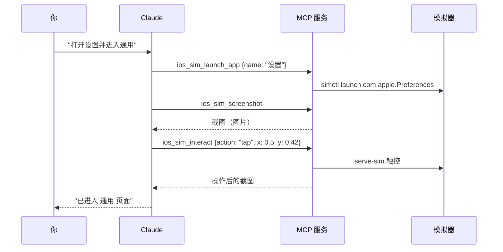

<p align="center">
  
</p>

<p align="center">
  
  
  
  
  
</p>

# iOS Simulator 插件（Claude Code）

在 Claude Code 里直接驱动 iOS 模拟器：**实时画面面板**、点击和手势、安装和启动 App、从源码**构建并运行**、推送通知、定位、深色模式、录屏……Claude 能看截图、能点屏幕，你也能在同一个面板里亲手操作同一台模拟器。

> [!NOTE]
> 本项目基于 **[dsh-ios](https://github.com/ZSeven-W/dsh-ios)** 二次开发。dsh-ios 是 DeepSeek Harness（DSH）的 iOS 插件（MIT，© 2026 ZSeven—W）。
> 我们把其中与宿主无关的核心模块移植过来，去掉 DSH 专有的绑定，改用 MCP SDK 重新封装成 **Claude Code 插件**，并针对 Claude 能"看图"这一点做了改造。详见下方 [与 dsh-ios 的区别](#与-dsh-ios-的区别)。

---

## 目录

- [效果预览](#效果预览)
- [支持的功能](#支持的功能)
- [工具一览（16 个）](#工具一览16-个)
- [运行要求](#运行要求)
- [安装](#安装)
- [快速上手](#快速上手)
- [实时面板](#实时面板)
- [架构](#架构)
- [与 dsh-ios 的区别](#与-dsh-ios-的区别)
- [环境变量](#环境变量)
- [常见问题](#常见问题)
- [开发](#开发)
- [路线图](#路线图)
- [致谢与许可](#致谢与许可)

---

## 效果预览

<p align="center">
  
</p>

<p align="center"><sub>实时面板示意：顶部切换设备、工具栏常用操作，画面上直接点击 / 拖动。</sub></p>

---

## 支持的功能

| 类别 | 支持什么 |
|---|---|
| 🎥 **实时画面** | 基于 serve-sim 的 MJPEG 视频流（不是轮询截图），浏览器里实时观看，断线按 1s → 2s → 5s 自动重连 |
| 👆 **交互** | 点击、拖动 / 滑动手势、按内容方向滚动、输入文字、硬件按键（Home、锁屏、Siri、音量…）、四向旋转 |
| 📱 **设备操作** | 后台 App（多任务）、锁屏、解锁、摇一摇、Siri、Action 按钮、窗口重新居中 |
| 👀 **Claude 看屏** | 截图以**图片**直接返回给 Claude（JPEG，长边 ≤ 1024 px）；每次交互后自动附带结果截图 |
| 🧭 **横竖屏** | 截图始终是正向的；Claude 给出的坐标会按当前方向自动换算到设备上 |
| 📦 **App 管理** | 列出已安装 App（名称按模拟器语言本地化，中文可搜）、按名称或 bundle id 启动 / 重启、安装 `.app`、卸载 |
| 🔨 **构建运行** | 支持 `.xcodeproj`、`.xcworkspace`、Swift Package：构建 → 安装 → 启动，失败时返回过滤后的编译错误 |
| 🌐 **环境模拟** | 打开 URL / Deep Link、模拟推送通知（APNs payload）、设置 / 清除 GPS 定位、浅色 / 深色模式 |
| 🎬 **录屏** | 开始 / 停止录屏，输出 `.mov` / `.mp4`，每台设备同时一个录屏 |
| 🖥️ **多设备** | 列出、启动、关闭任意模拟器；面板里可一键切换（未启动的会自动启动） |
| 🧠 **内置 Skill** | `ios-ui-automation`：教 Claude 按"观察 → 操作 → 确认"的节奏工作，并避开常见坑（例如不猜 bundle id） |
| 🔒 **安全** | 面板只监听 `127.0.0.1`，校验 Host / Origin 防 DNS 重绑定和跨站调用；所有命令用参数数组执行，无 shell 注入 |
| 🌏 **中英双语** | 面板界面按浏览器语言自动切换中文 / 英文 |

---

## 工具一览（16 个）

所有工具都接受可选的 `udid`（udid 或设备名，如 `"iPhone 17 Pro"`）。不传时依次使用：正在推流的设备 → 第一台已启动的设备。坐标一律是 **0..1 归一化值**。

### 设备与画面

| 工具 | 作用 |
|---|---|
| `ios_sim_devices` | 列出模拟器（已启动的在前，runtime 新的在前），可按名称 / udid / runtime 过滤 |
| `ios_sim_boot` | 启动模拟器并开始推流，返回 `panelUrl` |
| `ios_sim_shutdown` | 关闭模拟器（先停止它的录屏和推流） |
| `ios_sim_panel` | 为已启动的设备确保推流并返回 `panelUrl`，不会启动设备 |
| `ios_sim_screenshot` | 截图，以图片返回给 Claude，同时给出原尺寸 PNG 路径 |
| `ios_sim_interact` | 交互：`tap` / `type` / `button` / `gesture` / `scroll` / `rotate` / `device_action`，默认附带结果截图 |

### App

| 工具 | 作用 |
|---|---|
| `ios_sim_list_apps` | 列出已安装 App（bundle id、本地化名称、版本），可搜索，可包含系统 App |
| `ios_sim_launch_app` | 按 `bundleId` 或 `name`（显示名子串，支持中文）启动，可 `relaunch` |
| `ios_sim_build_run` | 构建 Xcode 项目 / workspace / Swift Package 并安装启动 |
| `ios_sim_install_app` | 安装已构建的 `.app`，返回其 bundle id |
| `ios_sim_uninstall_app` | 按 bundle id 卸载（连同数据） |

### 环境

| 工具 | 作用 |
|---|---|
| `ios_sim_open_url` | 打开 `https://…` 或 `myapp://path` 这类 Deep Link |
| `ios_sim_push` | 发送模拟推送，payload 需包含 `aps` 对象 |
| `ios_sim_location` | 设置经纬度，或 `clear: true` 清除 |
| `ios_sim_appearance` | 切换 `light` / `dark` |
| `ios_sim_record` | `start` / `stop` 录屏，返回文件路径、大小和时长 |

<details>
<summary><b>ios_sim_interact 的动作细节</b></summary>

| action | 关键参数 | 说明 |
|---|---|---|
| `tap` | `x`, `y` | 归一化坐标：`x = 像素x / 截图宽`，`y = 像素y / 截图高` |
| `type` | `text` | 仅支持美式键盘 ASCII（中文见 [常见问题](#常见问题)） |
| `button` | `name` | `home`、`lock`、`siri`、`volume-up`…，未知名称会返回完整列表 |
| `gesture` | `json` | 拖动 `{"fromX":0.1,"fromY":0.5,"toX":0.9,"toY":0.5,"duration":0.3}` 或单帧 `{"type":"begin","x":0.5,"y":0.5}` |
| `scroll` | `direction`, `amount?`, `x?`, `y?` | 方向按**内容**命名：`down` 表示看下面的内容（手指上滑）；`amount` 默认 0.6 |
| `rotate` | `orientation` | `portrait` / `landscape_left` / `portrait_upside_down` / `landscape_right` |
| `device_action` | `name` | `app-switcher` / `lock` / `unlock` / `shake` / `siri` / `action-button` / `re-center` |

连续操作时，除最后一步外传 `screenshot: false` 可以省下截图的 token。

</details>

---

## 运行要求

- **macOS + 完整 Xcode**（需要 `xcrun simctl`、`xcodebuild`）
- **Apple Silicon**（serve-sim 只提供 arm64 版本；Intel Mac 上可启动设备、截图、管理 App，但没有实时画面和触控）
- **Node.js ≥ 20**
- `device_action` 中除"锁屏"外的动作会操作 Simulator.app 菜单，需要在 **系统设置 ▸ 隐私与安全性 ▸ 辅助功能** 中给运行 Claude 的应用授权

---

## 安装

### 方式一：从 GitHub 安装（推荐）

在 Claude Code 中执行：

```text
/plugin marketplace add elisezhu123/cc-ios-simulator
/plugin install ios-simulator@ios-simulator-panel
```

### 方式二：从本地目录安装

```bash
git clone https://github.com/elisezhu123/cc-ios-simulator.git
```

```text
/plugin marketplace add /path/to/cc-ios-simulator
/plugin install ios-simulator@ios-simulator-panel
```

### 方式三：开发调试（直接加载目录）

```bash
claude --plugin-dir /path/to/cc-ios-simulator
```

> `dist/` 已随仓库提交，安装后无需构建。serve-sim 优先使用插件自带版本，找不到时自动 `npx -y serve-sim@0.1.47`。

---

## 快速上手

安装后直接用自然语言告诉 Claude 你想做什么：

```text
启动 iPhone 17 Pro 模拟器，并打开实时面板
```

`ios_sim_boot` 会返回 `panelUrl`（默认 `http://127.0.0.1:3456/`）。在 Claude 桌面版的 Code 标签页里，Claude 会在浏览器面板中打开它；在终端里使用时，把地址复制到浏览器即可。

更多示例：

```text
构建 ~/Projects/MyApp/MyApp.xcodeproj 并在模拟器上运行
打开"设置"，进入 通用 ▸ 关于本机，告诉我系统版本
在 MyApp 登录页输入 test@example.com，然后点登录，看看有没有报错
给 com.example.myapp 发一条推送："订单已发货"
把定位设到上海（31.2304, 121.4737），切换到深色模式，然后截图
开始录屏，把引导页从头滑到尾，再停止录屏
```

一次典型的交互流程：



---

## 实时面板

面板是一个本地网页（`127.0.0.1:3456` 起，被占用时自动 +1，最多到 +20）：

- **画面上直接操作**：单击即点击，按住拖动即手势；坐标自动扣除黑边，横屏时按方向换算。
- **顶栏**：设备选择器（选中未启动的设备会自动启动并切换推流）+ 连接状态（实时 / 连接中 / 离线）。
- **工具栏**：
  - 回到桌面：单击回主屏，**双击**打开后台 App；
  - 截图：在新标签页打开原尺寸截图；
  - 旋转：竖屏 → 横屏左 → 倒置 → 横屏右 循环；
  - 设备操作：后台 App / 锁屏 / 解锁 / 摇一摇 / Siri / Action 按钮 / 窗口重新居中；
  - 刷新。
- **显示设置**（保存在浏览器本地）：尺寸 适应 / 50–125% / S·M·L；外框 无框 / 边框 / 真机框。
- 你在面板里的操作和 Claude 的工具调用驱动的是**同一台模拟器**，可以随时接手或交还。

---

## 架构

<p align="center">
  
</p>

- 工具层和面板服务运行在同一个 MCP 进程里，共用一个 `SimHostController`。
- **懒启动**：MCP 服务启动时什么都不开，第一次需要画面时才启动 serve-sim，第一次需要 `panelUrl` 时才启动面板服务。
- serve-sim 空闲 5 分钟自动停流，异常退出 5 秒后自动重启；同一设备的流可被多个 Claude 会话共享。
- 退出时依次停止录屏（等待文件写完）→ 结束 serve-sim → 关闭面板服务。

<details>
<summary><b>目录结构</b></summary>

```text
.claude-plugin/
  plugin.json          # 插件清单，注册 MCP 服务
  marketplace.json     # 本仓库同时是一个 marketplace
skills/ios-ui-automation/SKILL.md   # 教 Claude 操作模拟器的 Skill
src/
  server.ts            # MCP 入口、组装、生命周期
  tools/               # core.ts / apps.ts / env.ts：16 个工具
  sim-host.ts          # serve-sim 生命周期
  stream-source.ts     # 视频流抽象（为真机预留）
  sim-gesture.ts       # WebSocket 手势通道
  simctl.ts            # simctl 封装
  build-run.ts         # xcodebuild 构建流程
  app-list.ts          # 已安装 App 解析与本地化
  screenshot.ts        # 截图缓存与缩放
  recorder.ts          # 录屏进程管理
  panel/               # 面板服务、安全边界 fence.ts、前端 client/
dist/                  # 打包产物（已提交）
test/                  # node:test 单元 / 集成测试，test/live/ 为真机冒烟
```

</details>

---

## 与 dsh-ios 的区别

| | dsh-ios | 本插件 |
|---|---|---|
| 宿主 | DeepSeek Harness（DSH） | **Claude Code** 插件（MCP 服务 + Skill） |
| 工具注册 | DSH `ToolRegistry` | MCP SDK `registerTool` + zod |
| 截图返回 | 纯文本描述（DeepSeek 是纯文本模型） | **图片块**直接给 Claude 看；交互后自动附带结果截图 |
| 面板 | DSH 内嵌（侧栏停靠、对话卡片等） | 独立的本地网页，可在 Code 标签页或任意浏览器打开 |
| 面板安全 | HMAC 签名 + 回环检查 | 独占 origin，沿用回环 / Host / Origin 检查 |
| 新增工具 | — | `open_url`、`push`、`location`、`appearance`、`record` |
| UI 自动化（无障碍树 / OCR）、日志调试、SwiftUI 预览、USB 真机 | 已支持 | **尚未支持**，计划分期移植，见 [路线图](#路线图) |

移植的文件在第一行注明了来源（`Ported from dsh-ios (MIT) @ d9a9731 — src/<file>`），完整清单见 [`THIRD_PARTY_NOTICES.md`](THIRD_PARTY_NOTICES.md)。

---

## 环境变量

| 变量 | 作用 | 默认值 |
|---|---|---|
| `IOS_SIM_PANEL_PORT` | 面板端口（被占用时依次尝试到 +20） | `3456` |
| `IOS_SIM_CACHE_DIR` | 截图、录屏、构建产物的缓存目录 | `~/Library/Caches/ios-simulator` |
| `IOS_SIM_SERVE_SIM_BIN` | 指定 serve-sim 可执行文件 | 插件自带，找不到时用 `npx -y serve-sim@0.1.47` |

缓存目录下：`screenshots/`（只保留最新 100 张）、`recordings/`、`builds/<slug>/DerivedData`、`tmp/`。

---

## 常见问题

<details>
<summary><b>如何输入中文或 emoji？</b></summary>

`type` 只支持美式键盘 ASCII。可以先写入模拟器剪贴板，再长按输入框选择"粘贴"：

```bash
printf '%s' '你好，世界' | xcrun simctl pbcopy <udid>
```

</details>

<details>
<summary><b>设备操作提示需要"辅助功能"权限？</b></summary>

除锁屏外的设备操作通过 AppleScript 操作 Simulator.app 菜单。打开 **系统设置 ▸ 隐私与安全性 ▸ 辅助功能**，勾选运行 Claude 的应用（终端、Claude 桌面版等）。

</details>

<details>
<summary><b>Xcode 27 下键盘输入没反应？</b></summary>

需要 Device Hub 正在运行，且该模拟器窗口可见并在最前。仍然无效时可运行 `serve-sim repair-input -d <udid>`（会重启 SpringBoard 并关闭 App）。

</details>

<details>
<summary><b>启动后没有 panelUrl / streaming 为 false？</b></summary>

说明 serve-sim 不可用（例如 Intel Mac 或无法 `npx`）。设备已启动，截图、App 管理、URL、推送、定位、外观、录屏仍可用，但点击、输入、滚动和面板不可用。若 `streaming: true` 但没有面板，调用 `ios_sim_panel` 会重试启动面板。

</details>

<details>
<summary><b>横屏后点击位置不对？</b></summary>

如果设备是在 Simulator.app 里手动旋转的，视频流可能不知道当前方向，结果里会带 `warning`。按提示调用一次 `ios_sim_interact {action: "rotate", orientation: "landscape_left" 或 "landscape_right"}` 即可同步。

</details>

---

## 开发

```bash
npm install
npm test              # 单元与集成测试，不需要模拟器
npm run build         # 类型检查 + 打包 dist/（dist 需要提交）
npm run check:bundle  # 启动 dist/server.js 并确认 16 个工具
IOS_SIM_SMOKE=1 npm run test:live   # 在真实模拟器上冒烟
npm run dev:panel     # 启动一台模拟器并保持面板运行，用于在浏览器里调试
npm run notices       # 按 esbuild 的打包清单重新生成 THIRD_PARTY_NOTICES.md（依赖变化后运行）
```

设计文档与实现计划见 [`docs/superpowers/`](docs/superpowers/)。

---

## 路线图

> [!IMPORTANT]
> 目前只完成了第 ① 期。第 ② – ⑤ 期**都还没有开始**，下表列出的工具现在都不能用，仅供了解后续规划。

| 期 | 内容 | 状态 |
|---|---|---|
| ① 基础 | 插件骨架、MCP 服务、serve-sim 视频流与触控、实时面板、16 个工具、Skill | ✅ 已完成（当前版本） |
| ② UI 自动化 | AXe 无障碍树 + Vision OCR：`ui_tree`、`tap_element`、`find_text`、`tap_text`、`wait_for` 等 | ⏳ 未开始 |
| ③ 日志与调试 | `logs`、`processes`、`backtrace`、`leaks`、`app_info` | ⏳ 未开始 |
| ④ SwiftUI 预览 | `ios_sim_preview` 热重载 | ⏳ 未开始 |
| ⑤ USB 真机 | WebDriverAgent + usbmux + devicectl，同一面板驱动真实 iPhone | ⏳ 未开始 |

---

## 致谢与许可

- **[dsh-ios](https://github.com/ZSeven-W/dsh-ios)**（MIT，© 2026 ZSeven—W）：DeepSeek Harness 的 iOS 插件，本项目的基础。serve-sim 生命周期、手势、设备操作、App 列表、构建流程、面板协议与布局都移植自这里，见 [`THIRD_PARTY_NOTICES.md`](THIRD_PARTY_NOTICES.md)。
- **[serve-sim](https://github.com/EvanBacon/serve-sim)**（Apache-2.0，Evan Bacon）：视频流与触控。
- 许可：[MIT](LICENSE)
