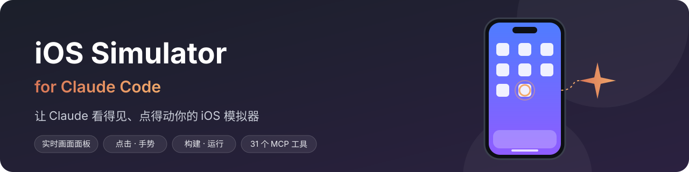
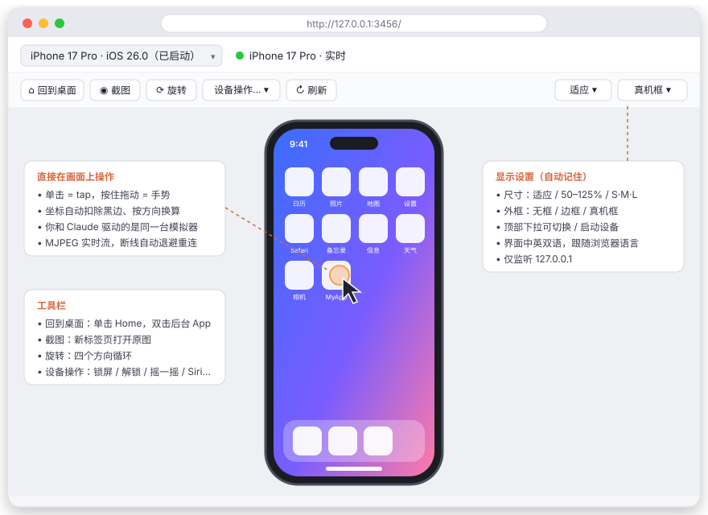
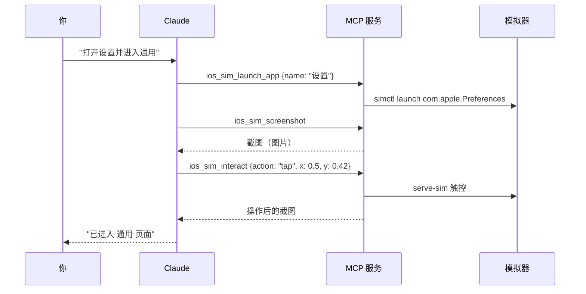
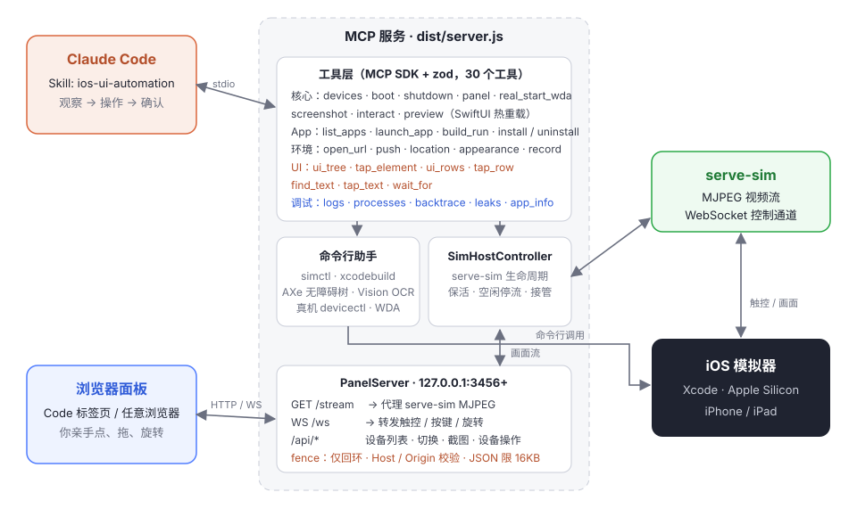

<p align="center">
  
</p>

<p align="center">
  
  
  
  
  
</p>

# iOS Simulator 插件（Claude Code）

在 Claude Code 里直接驱动 iOS 模拟器：**实时画面面板**、点击和手势、**按无障碍树 / 文字识别（OCR）定位并点击**、安装和启动 App、从源码**构建并运行**、推送通知、定位、深色模式、录屏、**日志、线程栈与内存泄漏排查**、**SwiftUI 预览热重载**……Claude 能看截图、能读懂屏幕上的控件和文字，你也能在同一个面板里亲手操作同一台模拟器。

> [!NOTE]
> 本项目基于 **[dsh-ios](https://github.com/ZSeven-W/dsh-ios)** 二次开发。dsh-ios 是 DeepSeek Harness（DSH）的 iOS 插件（MIT，© 2026 ZSeven—W）。
> 我们把其中与宿主无关的核心模块移植过来，去掉 DSH 专有的绑定，改用 MCP SDK 重新封装成 **Claude Code 插件**，并针对 Claude 能"看图"这一点做了改造。详见下方 [与 dsh-ios 的区别](#与-dsh-ios-的区别)。

---

## 目录

- [效果预览](#效果预览)
- [支持的功能](#支持的功能)
- [工具一览（31 个）](#工具一览31-个)
- [运行要求](#运行要求)
- [安装](#安装)
- [快速上手](#快速上手)
- [实时面板](#实时面板)
- [架构](#架构)
- [与 dsh-ios 的区别](#与-dsh-ios-的区别)
- [环境变量](#环境变量)
- [常见问题](#常见问题)
- [开发](#开发)
- [路线图](#路线图)
- [致谢与许可](#致谢与许可)

---

## 效果预览

<p align="center">
  
</p>

<p align="center"><sub>实时面板示意：顶部切换设备、工具栏常用操作，画面上直接点击 / 拖动。</sub></p>

---

## 支持的功能

| 类别 | 支持什么 |
|---|---|
| 🎥 **实时画面** | 基于 serve-sim 的 MJPEG 视频流（不是轮询截图），浏览器里实时观看，断线按 1s → 2s → 5s 自动重连 |
| 👆 **交互** | 点击、拖动 / 滑动手势、按内容方向滚动、输入文字、硬件按键（Home、锁屏、Siri、音量…）、四向旋转 |
| 🧩 **UI 自动化** | 读取无障碍树，按 identifier / label 点控件；Vision OCR 识别屏幕文字（中英文），按文字点击；等待文字出现 / 消失；点击后在同一次调用里确认结果 |
| ⚡ **SwiftUI 预览热重载** | 把 Swift 包里的 `#Preview` / `PreviewProvider` 直接跑在模拟器里；保存文件后几秒内热替换，不用重启 App；编译出错时保留上一个能用的画面 |
| 🐞 **日志与调试** | 读取模拟器统一日志（最近一段或限时实时抓取，可按 App / 谓词 / 正则过滤）；列出运行中的 App 进程；抓线程栈（LLDB 批处理，失败时退回 `sample`）；`leaks` 查内存泄漏或导出 `.memgraph`；查看 App 的安装路径、数据目录和 Info.plist |
| 📰 **列表 / 信息流** | 把信息流拆成一行行，解析每行的计数（如「57 回复」「18 喜欢」）；在行内相对位置点击，并用计数 ±1 确认操作生效 |
| 📱 **设备操作** | 后台 App（多任务）、锁屏、解锁、摇一摇、Siri、Action 按钮、窗口重新居中 |
| ✏️ **截图标注** | 面板里点铅笔按钮冻结当前画面，用画笔 / 直线 / 箭头 / 矩形 / 椭圆 / 文字（5 种颜色，可撤销重做）标出问题，点"添加到对话"：图片存给 Claude（`ios_sim_annotation`）并复制到剪贴板 |
| 👀 **Claude 看屏** | 截图以**图片**直接返回给 Claude（JPEG，长边 ≤ 1024 px）；每次交互后自动附带结果截图 |
| 🧭 **横竖屏** | 截图始终是正向的；Claude 给出的坐标会按当前方向自动换算到设备上 |
| 📦 **App 管理** | 列出已安装 App（名称按模拟器语言本地化，中文可搜）、按名称或 bundle id 启动 / 重启、安装 `.app`、卸载 |
| 🔨 **构建运行** | 支持 `.xcodeproj`、`.xcworkspace`、Swift Package：构建 → 安装 → 启动，失败时返回过滤后的编译错误 |
| 🌐 **环境模拟** | 打开 URL / Deep Link、模拟推送通知（APNs payload）、设置 / 清除 GPS 定位、浅色 / 深色模式 |
| 🎬 **录屏** | 开始 / 停止录屏，输出 `.mov` / `.mp4`，每台设备同时一个录屏 |
| 🖥️ **多设备** | 列出、启动、关闭任意模拟器；面板里可一键切换（未启动的会自动启动） |
| 📲 **USB 真机** | 列出连接的 iPhone / iPad；在真机上列出 / 启动 / 结束 App、安装已签名的 `.app`、查看进程和 App 信息（devicectl）。用 `ios_real_start_wda` 启动 WebDriverAgent 后，截图、点击、输入、按键、滑动、旋转、无障碍树、OCR 找字 / 点字、列表行都能在真机上用，面板也能显示真机的实时画面并直接操作 |
| 🧠 **内置 Skill** | `ios-ui-automation`：教 Claude 按"观察 → 操作 → 确认"的节奏工作，并避开常见坑（例如不猜 bundle id） |
| 🔒 **安全** | 面板只监听 `127.0.0.1`，校验 Host / Origin 防 DNS 重绑定和跨站调用；所有命令用参数数组执行，无 shell 注入 |
| 🌏 **中英双语** | 面板界面按浏览器语言自动切换中文 / 英文 |

---

## 工具一览（31 个）

所有工具都接受可选的 `udid`（udid 或设备名，如 `"iPhone 17 Pro"`）。以下工具还可以传**连接的真机**的 udid 或名字（见 `ios_sim_devices` 返回的 `realDevices`）：

- 直接可用（devicectl）：`ios_sim_list_apps`、`ios_sim_launch_app`、`ios_sim_install_app`、`ios_sim_processes`、`ios_sim_app_info`；
- 先用 `ios_real_start_wda` 启动 WebDriverAgent 后可用：`ios_sim_screenshot`、`ios_sim_interact`、`ios_sim_ui_tree`、`ios_sim_tap_element`、`ios_sim_find_text`、`ios_sim_tap_text`、`ios_sim_wait_for`、`ios_sim_ui_rows`、`ios_sim_tap_row`。

不传时依次使用：正在推流的设备 → 第一台已启动的设备。`ios_sim_interact` 的坐标是 **0..1 归一化值**；UI 自动化工具返回的位置是设备的**点（point）**坐标。

### 设备与画面

| 工具 | 作用 |
|---|---|
| `ios_sim_devices` | 列出模拟器（已启动的在前，runtime 新的在前），可按名称 / udid / runtime 过滤；连接的 iPhone / iPad 列在 `realDevices` 里 |
| `ios_sim_boot` | 启动模拟器并开始推流，返回 `panelUrl` |
| `ios_sim_shutdown` | 关闭模拟器（先停止它的录屏和推流） |
| `ios_sim_panel` | 为已启动的设备确保推流并返回 `panelUrl`，不会启动设备；传运行着 WebDriverAgent 的 iPhone 时，面板改为显示这台真机 |
| `ios_sim_screenshot` | 截图，以图片返回给 Claude，同时给出原尺寸 PNG 路径 |
| `ios_sim_interact` | 交互：`tap` / `type` / `button` / `gesture` / `scroll` / `rotate` / `device_action`，默认附带结果截图 |
| `ios_sim_annotation` | 返回你在面板里标注的截图（最新的在前，`index` 取更早的，`list: true` 只列清单）；截图结果里有新标注时会带 `userAnnotations` 提示 |
| `ios_real_start_wda` | 在 USB 连接的 iPhone / iPad 上启动 WebDriverAgent（已在运行就直接接管，否则签名、构建并启动，冷构建需要几分钟）；`status` 查看状态，`stop` 停止 |

### App

| 工具 | 作用 |
|---|---|
| `ios_sim_list_apps` | 列出已安装 App（bundle id、本地化名称、版本），可搜索，可包含系统 App |
| `ios_sim_launch_app` | 按 `bundleId` 或 `name`（显示名子串，支持中文）启动，可 `relaunch` |
| `ios_sim_build_run` | 构建 Xcode 项目 / workspace / Swift Package 并安装启动 |
| `ios_sim_install_app` | 安装已构建的 `.app`，返回其 bundle id |
| `ios_sim_uninstall_app` | 按 bundle id 卸载（连同数据） |

### 环境

| 工具 | 作用 |
|---|---|
| `ios_sim_open_url` | 打开 `https://…` 或 `myapp://path` 这类 Deep Link |
| `ios_sim_push` | 发送模拟推送，payload 需包含 `aps` 对象 |
| `ios_sim_location` | 设置经纬度，或 `clear: true` 清除 |
| `ios_sim_appearance` | 切换 `light` / `dark` |
| `ios_sim_record` | `start` / `stop` 录屏，返回文件路径、大小和时长 |

### UI 自动化

| 工具 | 作用 |
|---|---|
| `ios_sim_ui_tree` | 读取前台 App 的无障碍树：类型、label、identifier、value、enabled / selected、坐标（点）；默认排除屏幕外元素，输出上限约 40 KB |
| `ios_sim_tap_element` | 按 identifier 和 / 或 label 点击控件（先精确匹配，再不区分大小写的包含匹配）；屏幕外或禁用的控件会拒绝并说明原因 |
| `ios_sim_find_text` | 用 Vision OCR 识别当前屏幕文字，返回文字、置信度和位置（点） |
| `ios_sim_tap_text` | OCR 后点击匹配文字的中心；多处匹配时列出候选 |
| `ios_sim_wait_for` | 轮询 OCR，等文字出现或消失；超时返回 `matched: false`，不算错误 |
| `ios_sim_ui_rows` | 把列表 / 信息流拆成行：序号、坐标、合并后的 label，以及从 label 里解析出的计数 |
| `ios_sim_tap_row` | 在第 N 行内按相对位置点击；`expect_count` 可校验某个计数正好变化 ±1 |

### SwiftUI 预览

| 工具 | 作用 |
|---|---|
| `ios_sim_preview` | `start`（默认）：在插件缓存里生成一次性的预览宿主 App，把 Swift 包编译成动态库装进模拟器，并开始监听源码；每次保存都会重新编译并热替换，不重启 App。`status`：查看当前版本、预览列表、上次重载耗时和编译错误。`stop`：停止监听并卸载宿主 App。同一时间只能有一个预览会话 |

支持 `#Preview { … }`（含 `#Preview("名字", traits: …)`）和 `struct X: PreviewProvider`，只扫描包里 `.target(...)` 的源码。预览里可以用 `internal` 类型（入口以 `@testable import` 引入你的模块）。宿主 App 和编译产物都放在插件缓存里，**不会往你的包里写任何文件**。

### 日志与调试

| 工具 | 作用 |
|---|---|
| `ios_sim_logs` | 读取统一日志：`snapshot`（默认，`log show --last 2m`）或 `follow`（实时抓取 1–60 秒后返回）；可按 `bundle_id`、NSPredicate、级别、`grep` 过滤；保留最后约 300 行 / 30 KB |
| `ios_sim_processes` | 从模拟器自己的 launchd 列出运行中的 App 进程（pid、名称、bundle id） |
| `ios_sim_backtrace` | 一次性抓线程栈：LLDB 批处理（attach → backtrace → detach），不能 attach 时退回 `sample`；主线程在前，最多约 200 行 |
| `ios_sim_leaks` | `leaks` 分析：`summary` 返回泄漏数、字节数和最多的 30 种类型；`memgraph` 导出文件供 Instruments 打开 |
| `ios_sim_app_info` | 已安装 App 的 `.app` 路径、数据目录（Documents 等）和 Info.plist 信息 |

`ios_sim_backtrace` / `ios_sim_leaks` 只会作用于**这台模拟器里的 App 进程**，不会碰宿主机上的其他进程；结束后（包括超时被杀）都会确认 App 恢复运行，不会让它卡在调试器里。

`ios_sim_tap_element`、`ios_sim_tap_text` 支持 `expect_text` / `expect_gone`：点击后轮询 OCR，在同一次调用里告诉你预期文字有没有出现 / 消失。三个点击工具都会附带结果截图。

<details>
<summary><b>ios_sim_interact 的动作细节</b></summary>

| action | 关键参数 | 说明 |
|---|---|---|
| `tap` | `x`, `y` | 归一化坐标：`x = 像素x / 截图宽`，`y = 像素y / 截图高` |
| `type` | `text` | 仅支持美式键盘 ASCII（中文见 [常见问题](#常见问题)） |
| `button` | `name` | `home`、`lock`、`siri`、`volume-up`…，未知名称会返回完整列表 |
| `gesture` | `json` | 拖动 `{"fromX":0.1,"fromY":0.5,"toX":0.9,"toY":0.5,"duration":0.3}` 或单帧 `{"type":"begin","x":0.5,"y":0.5}` |
| `scroll` | `direction`, `amount?`, `x?`, `y?` | 方向按**内容**命名：`down` 表示看下面的内容（手指上滑）；`amount` 默认 0.6 |
| `rotate` | `orientation` | `portrait` / `landscape_left` / `portrait_upside_down` / `landscape_right` |
| `device_action` | `name` | `app-switcher` / `lock` / `unlock` / `shake` / `siri` / `action-button` / `re-center` |

连续操作时，除最后一步外传 `screenshot: false` 可以省下截图的 token。

</details>

---

## 运行要求

- **macOS + 完整 Xcode**（需要 `xcrun simctl`、`xcodebuild`）
- **Apple Silicon**（serve-sim 只提供 arm64 版本；Intel Mac 上可启动设备、截图、管理 App，但没有实时画面和触控）
- **Node.js ≥ 20**
- UI 自动化：
  - 无障碍树工具需要 [AXe](https://github.com/cameroncooke/AXe)。会依次查找 PATH 和 Homebrew（`brew install cameroncooke/axe/axe`），都没有时首次使用自动下载固定版本 v1.8.0，并校验 SHA-256。
  - OCR 工具需要 `swiftc`（Xcode 或 Command Line Tools 自带），首次使用时把插件自带的 `assets/ocr.swift` 编译进缓存。
- SwiftUI 预览：需要 Swift 包（有 `Package.swift`，至少一个 `.target`），iOS 最低版本按 17 起算（`#Preview` 宏需要）。第一次启动要完整编译整个包，可能需要一分钟左右。
- 调试：`ios_sim_backtrace` 用 LLDB attach，`ios_sim_leaks` 要检查 App 进程，都需要开启 macOS 开发者模式（运行一次 `sudo DevToolsSecurity -enable`）。没开时 backtrace 会退回 `sample`，leaks 会报错并提示这条命令。
- USB 真机：数据线连接、手机已解锁并"信任此电脑"、打开"开发者模式"。截图 / 点击 / UI 工具还需要：
  - 在 Xcode ▸ Settings ▸ Accounts 登录 Apple ID（免费的个人团队也可以），或设置 `IOS_SIM_TEAM_ID`；
  - 一份 [WebDriverAgent](https://github.com/appium/WebDriverAgent) 源码：`git clone https://github.com/appium/WebDriverAgent.git ~/Library/Caches/ios-simulator/WebDriverAgent`（或用 `IOS_SIM_WDA_DIR` 指向已有的目录）。插件不会修改这份源码，而是复制一份到缓存里，打上"只监听手机本机回环地址"的安全补丁再构建，所以 WDA 只能通过 USB 隧道访问，同一 Wi-Fi 下的其他设备连不上；
  - 隧道优先直接走 usbmuxd，不行时用 `iproxy`（`brew install libimobiledevice`）。
- `device_action` 中除"锁屏"外的动作会操作 Simulator.app 菜单，需要在 **系统设置 ▸ 隐私与安全性 ▸ 辅助功能** 中给运行 Claude 的应用授权

---

## 安装

### 方式一：从 GitHub 安装（推荐）

在 Claude Code 中执行：

```text
/plugin marketplace add elisezhu123/cc-ios-simulator
/plugin install ios-simulator@ios-simulator-panel
```

### 方式二：从本地目录安装

```bash
git clone https://github.com/elisezhu123/cc-ios-simulator.git
```

```text
/plugin marketplace add /path/to/cc-ios-simulator
/plugin install ios-simulator@ios-simulator-panel
```

### 方式三：开发调试（直接加载目录）

```bash
claude --plugin-dir /path/to/cc-ios-simulator
```

> `dist/` 已随仓库提交，安装后无需构建。serve-sim 优先使用插件自带版本，找不到时自动 `npx -y serve-sim@0.1.47`。

---

## 快速上手

安装后直接用自然语言告诉 Claude 你想做什么：

```text
启动 iPhone 17 Pro 模拟器，并打开实时面板
```

`ios_sim_boot` 会返回 `panelUrl`（默认 `http://127.0.0.1:3456/`）。在 Claude 桌面版的 Code 标签页里，Claude 会在浏览器面板中打开它；在终端里使用时，把地址复制到浏览器即可。

更多示例：

```text
构建 ~/Projects/MyApp/MyApp.xcodeproj 并在模拟器上运行
打开"设置"，进入 通用 ▸ 关于本机，告诉我系统版本
在 MyApp 登录页输入 test@example.com，然后点登录，看看有没有报错
给 com.example.myapp 发一条推送："订单已发货"
把定位设到上海（31.2304, 121.4737），切换到深色模式，然后截图
开始录屏，把引导页从头滑到尾，再停止录屏
在"设置"里点"通用"，确认页面出现"关于本机"
等"加载中"消失后，读一下屏幕上的所有文字
在信息流第 2 条上点赞，并确认喜欢数加 1
MyApp 点登录后卡住了，抓一下主线程的栈，再看看最近 1 分钟它打了什么日志
检查一下 MyApp 有没有内存泄漏
在模拟器里预览 ~/Projects/DesignKit 的 SwiftUI 预览，我改代码时自动刷新
```

一次典型的交互流程：



---

## 实时面板

面板是一个本地网页（`127.0.0.1:3456` 起，被占用时自动 +1，最多到 +20）：

- **画面上直接操作**：单击即点击，按住拖动即手势；坐标自动扣除黑边，横屏时按方向换算。
- **顶栏**：设备选择器（选中未启动的设备会自动启动并切换推流）+ 连接状态（实时 / 连接中 / 离线）。
- **工具栏**：
  - 回到桌面：单击回主屏，**双击**打开后台 App；
  - 标注（铅笔）：冻结一张原尺寸截图，在上面画画笔 / 直线 / 箭头 / 矩形 / 椭圆 / 文字，红蓝绿黑白 5 种颜色，撤销（⌘Z）/ 重做（⇧⌘Z）/ 清空，Esc 关闭；"添加到对话"（⌘↩）把标注图保存给 Claude（让它调用 `ios_sim_annotation`，或截图时它会看到提示），同时复制到剪贴板，可直接粘贴进对话；
  - 截图：在新标签页打开原尺寸截图；
  - 旋转：竖屏 → 横屏左 → 倒置 → 横屏右 循环；
  - 设备操作：后台 App / 锁屏 / 解锁 / 摇一摇 / Siri / Action 按钮 / 窗口重新居中；
  - 刷新。
- **显示设置**（保存在浏览器本地）：尺寸 适应 / 50–125% / S·M·L；外框 无框 / 边框 / 真机框。
- 你在面板里的操作和 Claude 的工具调用驱动的是**同一台模拟器**，可以随时接手或交还。
- **真机**：`ios_real_start_wda` 启动 WebDriverAgent 后，设备选择器的"iPhone / iPad"分组里会出现这台手机（或调用 `ios_sim_panel {udid: 这台手机}`）。画面来自 WDA 的 MJPEG 流（经 USB 隧道），单击 = 点击，拖动 = 滑动（松手时按拖动时长一次发出），回到桌面、截图、旋转可用，设备操作只有锁屏 / 解锁 / Siri。

---

## 架构

<p align="center">
  
</p>

- 工具层和面板服务运行在同一个 MCP 进程里，共用一个 `SimHostController`。
- **懒启动**：MCP 服务启动时什么都不开，第一次需要画面时才启动 serve-sim，第一次需要 `panelUrl` 时才启动面板服务。
- serve-sim 空闲 5 分钟自动停流，异常退出 5 秒后自动重启；同一设备的流可被多个 Claude 会话共享。
- 退出时依次停止录屏（等待文件写完）→ 结束 serve-sim → 关闭面板服务。

<details>
<summary><b>目录结构</b></summary>

```text
.claude-plugin/
  plugin.json          # 插件清单，注册 MCP 服务
  marketplace.json     # 本仓库同时是一个 marketplace
skills/ios-ui-automation/SKILL.md   # 教 Claude 操作模拟器的 Skill
assets/ocr.swift                    # Vision OCR 助手源码（首次使用时编译）
assets/preview-host/                # SwiftUI 预览宿主 App 的源码
src/
  server.ts            # MCP 入口、组装、生命周期
  tools/               # core.ts / apps.ts / env.ts / ui.ts / debug.ts / preview.ts：31 个工具
  sim-host.ts          # serve-sim 生命周期
  stream-source.ts     # 视频流抽象（为真机预留）
  sim-gesture.ts       # WebSocket 手势通道
  simctl.ts            # simctl 封装
  build-run.ts         # xcodebuild 构建流程
  app-list.ts          # 已安装 App 解析与本地化
  screenshot.ts        # 截图缓存与缩放
  uitree-backend.ts    # AXe 查找 / 下载 / 调用
  ocr-backend.ts       # Vision OCR 助手的编译与调用
  uitree.ts            # 无障碍树裁剪、控件匹配、OCR 文字匹配
  list-rows.ts         # 列表行识别与计数解析
  devtools.ts          # 日志 / 调试子进程运行器与输出解析
  devicectl.ts         # 真机：xcrun devicectl 的封装
  usbmux.ts            # 真机：直接走 usbmuxd 的端口转发
  wda-setup.ts         # 真机：签名团队选择、WDA 源码暂存与安全补丁
  wda-host.ts          # 真机：WDA 的接管 / 构建启动 / 隧道 / 停止
  wda-client.ts        # 真机：WDA HTTP 客户端与启动失败分类
  wda-uitree.ts        # 真机：WDA XML → 与模拟器相同的无障碍树结构
  real-ui.ts           # 真机：截图、交互和无障碍树的 WDA 实现
  preview-source.ts    # Package.swift 解析、预览扫描、生成 Swift 代码
  preview-host.ts      # 预览会话：构建宿主 App、热替换、文件监听
  recorder.ts          # 录屏进程管理
  panel/               # 面板服务、安全边界 fence.ts、前端 client/
dist/                  # 打包产物（已提交）
test/                  # node:test 单元 / 集成测试，test/live/ 为真机冒烟
```

</details>

---

## 与 dsh-ios 的区别

| | dsh-ios | 本插件 |
|---|---|---|
| 宿主 | DeepSeek Harness（DSH） | **Claude Code** 插件（MCP 服务 + Skill） |
| 工具注册 | DSH `ToolRegistry` | MCP SDK `registerTool` + zod |
| 截图返回 | 纯文本描述（DeepSeek 是纯文本模型） | **图片块**直接给 Claude 看；交互后自动附带结果截图 |
| 面板 | DSH 内嵌（侧栏停靠、对话卡片等） | 独立的本地网页，可在 Code 标签页或任意浏览器打开 |
| 面板安全 | HMAC 签名 + 回环检查 | 独占 origin，沿用回环 / Host / Origin 检查 |
| 新增工具 | — | `open_url`、`push`、`location`、`appearance`、`record` |
| UI 自动化 | 模拟器 + 真机 | 已移植（7 个工具，模拟器 + 真机），点击工具额外返回结果截图 |
| 日志与调试 | 模拟器 + 真机 | 已移植模拟器部分（5 个工具） |
| SwiftUI 预览热重载 | 已支持 | 已移植（`ios_sim_preview`） |
| USB 真机 | 已支持 | devicectl 的设备 / App / 进程操作、WebDriverAgent 的截图 / 点击 / 无障碍树 / OCR 已移植（简化版：一次一台设备，工具调用中不会自动构建 WDA），面板可显示真机实时画面（WDA MJPEG）。卸载在真机上被拒绝 |

移植的文件在第一行注明了来源（`Ported from dsh-ios (MIT) @ d9a9731 — src/<file>`），完整清单见 [`THIRD_PARTY_NOTICES.md`](THIRD_PARTY_NOTICES.md)。

---

## 环境变量

| 变量 | 作用 | 默认值 |
|---|---|---|
| `IOS_SIM_PANEL_PORT` | 面板端口（被占用时依次尝试到 +20） | `3456` |
| `IOS_SIM_CACHE_DIR` | 截图、录屏、构建产物的缓存目录 | `~/Library/Caches/ios-simulator` |
| `IOS_SIM_SERVE_SIM_BIN` | 指定 serve-sim 可执行文件 | 插件自带，找不到时用 `npx -y serve-sim@0.1.47` |
| `IOS_SIM_AXE_BIN` | 指定 axe 可执行文件（路径无效时直接报错，不会退回其他查找方式） | 依次查找 PATH、Homebrew、插件缓存，都没有就下载 |
| `IOS_SIM_AXE_OFFLINE` | 设为 `1` 时不自动下载 AXe | 未设置 |
| `IOS_SIM_SWIFTC` | 指定编译 OCR 助手用的 swiftc | PATH 中的 `swiftc` |
| `IOS_SIM_TEAM_ID` | 构建 WebDriverAgent 用的签名团队 ID（10 位） | 从 Xcode 登录的账号和钥匙串里的开发证书自动选择；找不到就报错并说明怎么设置，**没有内置默认值** |
| `IOS_SIM_WDA_BUNDLE_ID` | WebDriverAgent 的 bundle id | `dev.ios-simulator.wda.t<团队ID>` |
| `IOS_SIM_WDA_DIR` | 已有的 WebDriverAgent 源码目录 | `<缓存目录>/WebDriverAgent` |

缓存目录下：`screenshots/`（只保留最新 100 张）、`recordings/`、`samples/`（`sample` 报告）、`memgraphs/`、`preview/`（预览宿主 App 和编译产物）、`builds/<slug>/DerivedData`、`bin/axe/`（下载的 AXe）、`bin/ocr/`（编译好的 OCR 助手）、`tmp/`。

---

## 常见问题

<details>
<summary><b>如何输入中文或 emoji？</b></summary>

`type` 只支持美式键盘 ASCII。可以先写入模拟器剪贴板，再长按输入框选择"粘贴"：

```bash
printf '%s' '你好，世界' | xcrun simctl pbcopy <udid>
```

</details>

<details>
<summary><b>设备操作提示需要"辅助功能"权限？</b></summary>

除锁屏外的设备操作通过 AppleScript 操作 Simulator.app 菜单。打开 **系统设置 ▸ 隐私与安全性 ▸ 辅助功能**，勾选运行 Claude 的应用（终端、Claude 桌面版等）。

</details>

<details>
<summary><b>Xcode 27 下键盘输入没反应？</b></summary>

需要 Device Hub 正在运行，且该模拟器窗口可见并在最前。仍然无效时可运行 `serve-sim repair-input -d <udid>`（会重启 SpringBoard 并关闭 App）。

</details>

<details>
<summary><b>启动后没有 panelUrl / streaming 为 false？</b></summary>

说明 serve-sim 不可用（例如 Intel Mac 或无法 `npx`）。设备已启动，截图、App 管理、URL、推送、定位、外观、录屏仍可用，但点击、输入、滚动和面板不可用。若 `streaming: true` 但没有面板，调用 `ios_sim_panel` 会重试启动面板。

</details>

<details>
<summary><b>UI 自动化工具提示 AXe 或 OCR 不可用？</b></summary>

- **AXe**：可以运行 `brew install cameroncooke/axe/axe` 自己装，或者保证能访问 github.com，让插件自动下载。不能联网的环境里设置 `IOS_SIM_AXE_OFFLINE=1`，并用 `IOS_SIM_AXE_BIN` 指向已有的 axe。
- **OCR**：需要 `swiftc`。运行 `xcode-select --install` 安装 Command Line Tools，或者安装完整 Xcode。
- 没有 AXe 时 `ios_sim_find_text` 仍然能用，只是坐标会以截图像素返回，结果里的 `note` 会说明这一点。

</details>

<details>
<summary><b>backtrace / leaks 提示 "not allowed to attach" 或 Developer Mode？</b></summary>

在 Mac 上运行一次 `sudo DevToolsSecurity -enable` 开启开发者模式。没开时 `ios_sim_backtrace` 会自动改用 `sample`，结果里 `engine` 为 `sample`，`note` 会说明原因。想让 `leaks` 带上分配调用栈，要用 `SIMCTL_CHILD_MallocStackLogging=1 xcrun simctl launch <udid> <bundle_id>` 启动 App。

</details>

<details>
<summary><b>SwiftUI 预览启动失败或改了代码没刷新？</b></summary>

- 用 `ios_sim_preview {action: "status"}` 查看：`lastBuildError` 是最近一次编译错误的末尾，`loadedGeneration` 是宿主 App 实际加载到的版本。
- 预览里用到的类型在另一个 target 里时，确保那个 target 在 `Package.swift` 的 `.target(...)` 里。
- 预览依赖 App 里的资源或环境（如 `@EnvironmentObject`）时，要在 `#Preview` 里自己提供。

</details>

<details>
<summary><b>连着 iPhone，但 `realDevices` 里没有，或提示 not available？</b></summary>

用数据线连接，解锁手机并点"信任此电脑"，在"设置 ▸ 隐私与安全性"里打开"开发者模式"（手机会重启）。然后在终端运行 `xcrun devicectl list devices` 确认能看到这台设备。真机上的 App 名称是 devicectl 返回的基础（通常是英文）名，按中文名搜不到时用英文名或 bundle id。

</details>

<details>
<summary><b>`ios_real_start_wda` 失败了？</b></summary>

错误信息会说明原因和处理方法，常见的有：

- **手机锁着**：解锁即可，WDA 会自己继续；
- **开发者证书不受信任**：在手机"设置 ▸ 通用 ▸ VPN 与设备管理"里信任你的开发者证书，然后重试；
- **免费团队的描述文件过期**（7 天有效）：重新运行 `ios_real_start_wda`，xcodebuild 会重新签发；
- **没有签名团队**：在 Xcode ▸ Settings ▸ Accounts 登录 Apple ID，或设置 `IOS_SIM_TEAM_ID`；
- **没有 WebDriverAgent 源码**：按错误里给的 `git clone` 命令下载；
- **安全补丁不匹配**：WebDriverAgent 更新后，插件找不到要修改的代码位置时会拒绝构建（不会构建一个对局域网开放的 WDA），换用经过验证的版本即可。

其他工具在 WDA 没运行时只会提示先运行 `ios_real_start_wda`，不会在工具调用里偷偷构建。

</details>

<details>
<summary><b>横屏后点击位置不对？</b></summary>

如果设备是在 Simulator.app 里手动旋转的，视频流可能不知道当前方向，结果里会带 `warning`。按提示调用一次 `ios_sim_interact {action: "rotate", orientation: "landscape_left" 或 "landscape_right"}` 即可同步。

</details>

---

## 开发

```bash
npm install
npm test              # 单元与集成测试，不需要模拟器
npm run build         # 类型检查 + 打包 dist/（dist 需要提交）
npm run check:bundle  # 启动 dist/server.js 并确认 31 个工具
IOS_SIM_SMOKE=1 npm run test:live   # 在真实模拟器上冒烟
npm run dev:panel     # 启动一台模拟器并保持面板运行，用于在浏览器里调试
npm run notices       # 按 esbuild 的打包清单重新生成 THIRD_PARTY_NOTICES.md（依赖变化后运行）
```

设计文档与实现计划见 [`docs/superpowers/`](docs/superpowers/)。

---

## 路线图

> [!IMPORTANT]
> 第 ① – ⑤ 期都已完成（第 ③ 期的日志、线程栈、内存泄漏只支持模拟器）。真机部分（第 ⑤ 期）目前只有单元测试和模拟的浏览器测试，**尚未在真机上验证**。

| 期 | 内容 | 状态 |
|---|---|---|
| ① 基础 | 插件骨架、MCP 服务、serve-sim 视频流与触控、实时面板、16 个工具、Skill | ✅ 已完成 |
| ② UI 自动化 | AXe 无障碍树 + Vision OCR：`ui_tree`、`tap_element`、`find_text`、`tap_text`、`wait_for`、`ui_rows`、`tap_row` | ✅ 已完成（模拟器 + 真机） |
| ③ 日志与调试 | `logs`、`processes`、`backtrace`、`leaks`、`app_info` | ✅ 已完成（模拟器；真机支持 `processes`、`app_info`） |
| ④ SwiftUI 预览 | `ios_sim_preview` 热重载 | ✅ 已完成 |
| ⑤a USB 真机：devicectl | 列出真机；真机上的 App 列表 / 启动 / 安装、进程、App 信息 | ✅ 已完成 |
| ⑤b USB 真机：WebDriverAgent | `ios_real_start_wda`：签名、构建启动 WDA、usbmux 转发；真机截图、点击、输入、无障碍树、OCR 点击 | ✅ 已完成（待真机验证） |
| ⑤c USB 真机：实时画面 | 面板显示真机画面（WDA MJPEG）并可点击、滑动 | ✅ 已完成（待真机验证） |

---

## 致谢与许可

- **[dsh-ios](https://github.com/ZSeven-W/dsh-ios)**（MIT，© 2026 ZSeven—W）：DeepSeek Harness 的 iOS 插件，本项目的基础。serve-sim 生命周期、手势、设备操作、App 列表、构建流程、面板协议与布局都移植自这里，见 [`THIRD_PARTY_NOTICES.md`](THIRD_PARTY_NOTICES.md)。
- **[serve-sim](https://github.com/EvanBacon/serve-sim)**（Apache-2.0，Evan Bacon）：视频流与触控。
- 许可：[MIT](LICENSE)
